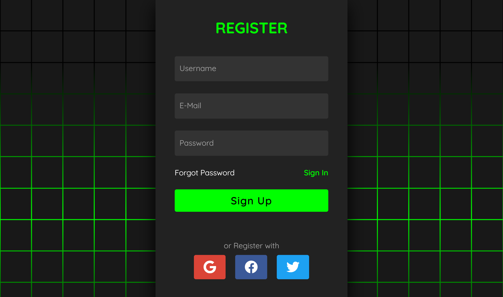
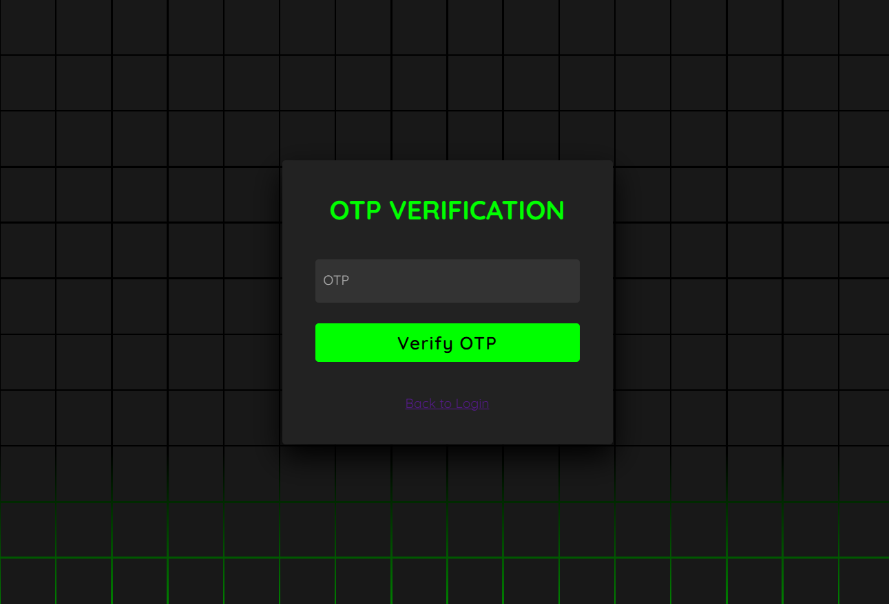
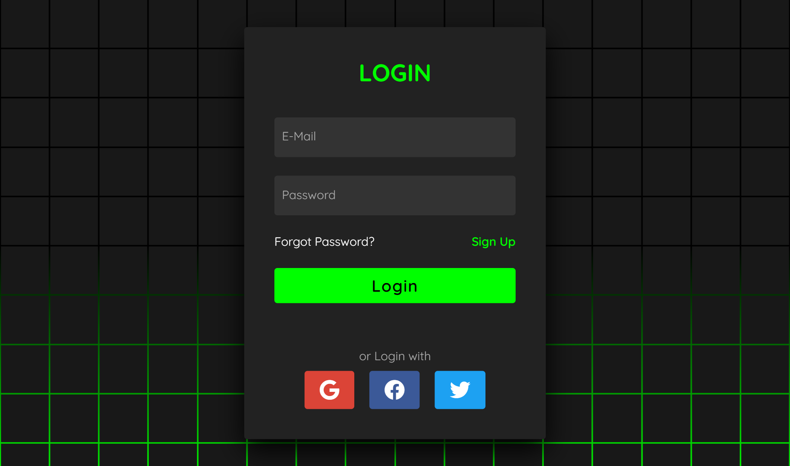
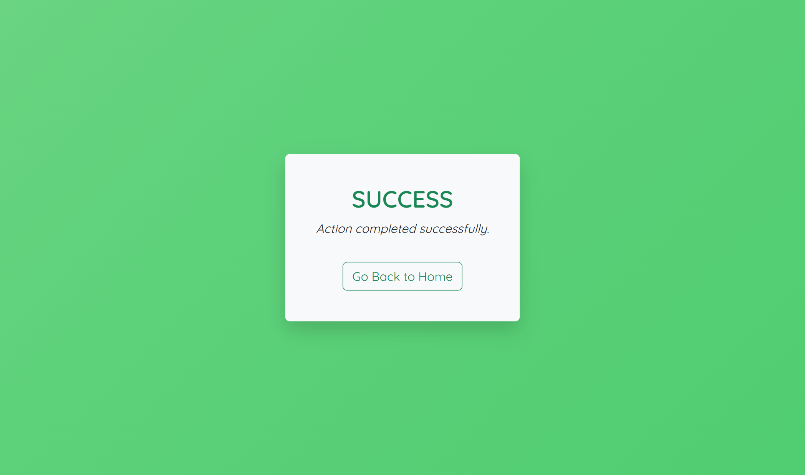
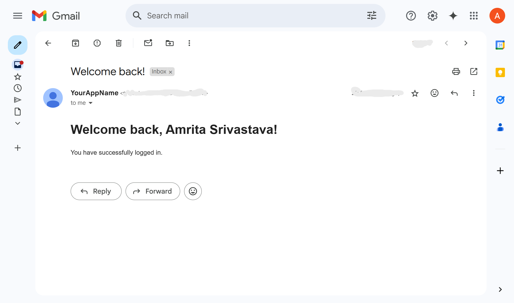

# 📝 Registration Form Project

The **Registration Form Project** is a complete user authentication system developed using **Node.js**, **Express**, and **MongoDB**. It provides both manual registration with **OTP-based email verification** and **Google OAuth login** through **Passport.js**, ensuring flexible and secure access for users. 

Once registered or logged in, users are authenticated using **JWT tokens**, and their sessions are managed effectively to maintain persistent login states. The **frontend** is built with clean and responsive **HTML, CSS, and vanilla JavaScript**, offering a smooth user experience.

On the **backend**, robust logic ensures secure data handling, user validation, and integration with external services like email and Google OAuth. This project serves as a practical example of building modern authentication flows in full-stack web development.

---

## 🚀 Features

- User registration with **OTP verification via email**
- **Google OAuth 2.0** login/signup
- **Welcome email** sent after successful registration
- **JWT-based** secure login system
- **Sessions managed** using `express-session`
- Uses **MongoDB Atlas** for cloud database
- Organized MVC structure for maintainability

---

## 🗂 Project Structure

```
    registration-form/      
    ├── config/                                     #Passport.js config (Google Auth)
    ├── controllers/                                # Auth logic: OTP & Google
    │ ├── authController.js
    │ └── googleAuthController.js
    ├── middleware/                                 # Custom middleware
    ├── models/
    │ └── User.js                                   # Mongoose User model
    ├── public/                                     # Static frontend (HTML, CSS)
    │ ├── index.html                                # Registration form
    │ ├── login.html                                # Login page
    │ ├── verify-otp.html                           # OTP verification
    │ ├── success.html                              # Login success
    │ ├── error.html                                # Error screen
    │ └── styles.css                                # Styling
    ├── screenshots/
    │   ├── registration-page.png
    │   ├── otp-verification.png
    │   ├── login-page.png
    │   ├── success-page.png
    │   ├── google-auth-email.png
    ├── routes/
    │ └── authRoutes.js                             # Express routes
    ├── utils/
    │ └── sendEmail.js                              # Utility to send emails
    ├── .env # Environment variables
    ├── server.js                                   # Main server entry point
    ├── package.json
    └── README.md
```

---

## ⚙️ Technologies Used

- **Frontend**: HTML, CSS, JavaScript
- **Backend**: Node.js, Express.js
- **Database**: MongoDB Atlas (via Mongoose)
- **Authentication**: JWT, Google OAuth 2.0, OTP
- **Email Service**: Nodemailer (SMTP)
- **Session**: express-session

---

## 🔐 Authentication Flow

### 🔸 Manual Registration

1. User visits `/index.html` and Register the form.
2. An OTP is sent to the provided email using `sendEmail.js`.
3. User enters OTP at `/verify-otp.html`.
4. On successful verification:
   - Account is created in MongoDB.
   - Welcome email is sent.
   - User is redirected to `/login.html`.

### 🔸 Login

1. User enters email & password at `/login.html`.
2. Server validates credentials.
3. On success:
   - JWT token is issued.
   - Session is created.
   - User is redirected to `/success.html`.

### 🔸 Google OAuth

1. User clicks **Google Login**.
2. Google OAuth flow via Passport.js.
3. New account is created (if first login).
4. Welcome email sent.
5. User redirected to `/success.html`.

---

### 🖼️ Screenshots

#### Registration Page


#### OTP Verification Page


#### Login Success Page


#### Success Page


#### Google OAuth Welcome Email


---

## 📬 Email Integration

- OTP emails are triggered during registration.
- Welcome emails are sent after:
  - Successful manual registration
  - Google OAuth-based registration

---

## 📌 API Endpoints

### 🔹 `POST /register`
Registers a new user and sends OTP to email.

### 🔹 `POST /verify-otp`
Verifies OTP and creates the user account.

### 🔹 `POST /login`
Authenticates user using email and password.

### 🔹 `GET /auth/google`
Initiates Google OAuth login.

### 🔹 `GET /auth/google/callback`
Google callback URL (used internally by Passport.js).

---

## 📦 Setup Instructions

### 🔹 Prerequisites:

- [Node.js installed](https://nodejs.org/)
- [MongoDB Atlas account](https://www.mongodb.com/cloud/atlas)
- [Gmail account (or SMTP credentials)](https://support.google.com/mail/answer/7126229?hl=en)

### 🔹 Installation

1. Clone the repo:
   
        `git clone https://github.com/Amritasri10/registration-form.git
         cd registration-form`

2. Install dependencies:
   
        `npm install` 

3. Create .env file:
   
       `PORT=5000
        MONGO_URI=your_mongo_connection_string
        JWT_SECRET=your_jwt_secret
        EMAIL_USER=your_email@example.com
        EMAIL_PASS=your_email_password
        GOOGLE_CLIENT_ID=your_google_client_id
        GOOGLE_CLIENT_SECRET=your_google_client_secret`

4. Start the app:
   
        `node server.js`

5. Open your browser and visit:

        `http://localhost:5000`

---

## 🧪 Testing Instructions

- Manual Register → OTP → Login → Success
- Try wrong OTP → Should show error
- Try Google OAuth → Should redirect and welcome
- Check email inbox for OTP and Welcome mails

---

## 📄 License

This project is licensed under the MIT License - feel free to use it for personal or academic projects.

---

## Author 

Connect with me on:
[LinkedIn ](https://www.linkedin.com/in/amrita-srivastava10/) | [GitHub](https://github.com/Amritasri10)
